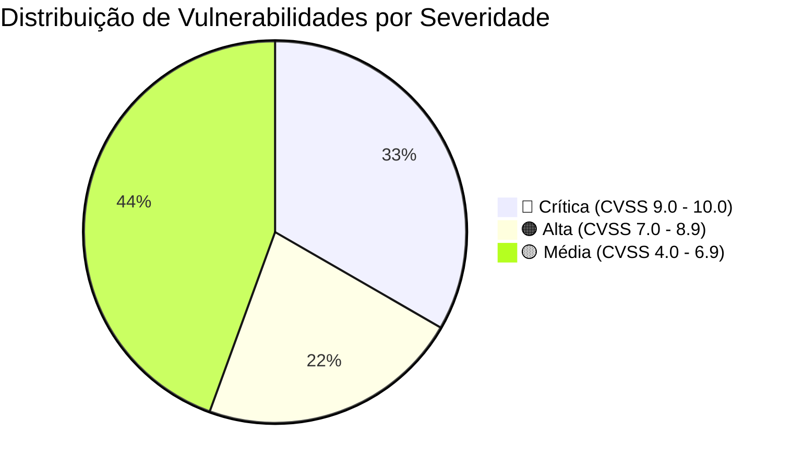
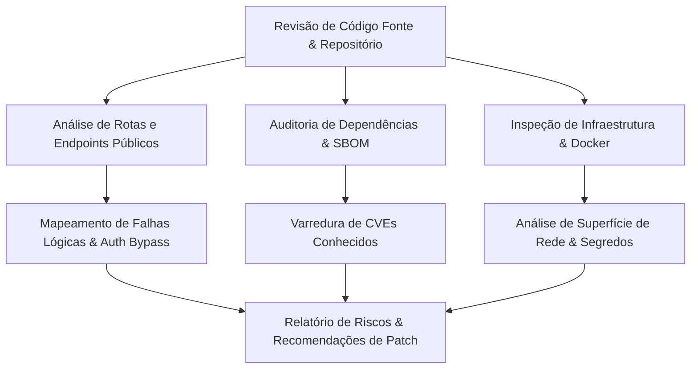
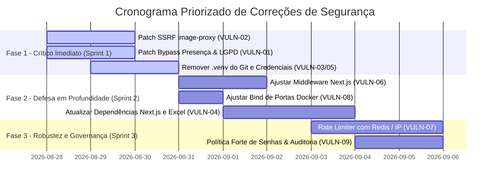

# RELATÓRIO TÉCNICO DE AUDITORIA DE SEGURANÇA DA INFORMAÇÃO
## Sistema de Controle de Patrimônio, Estoque Multimídia e Biometria Facial — UniFAP

---

| Metadado | Detalhe |
| :--- | :--- |
| **Projeto** | UniFAP — Estoque Multimídia & Reconhecimento Biométrico |
| **Arquitetura** | Next.js 14 (App Router) + Prisma ORM + PostgreSQL (pgvector) + FastAPI (Python 3.10) |
| **Data da Avaliação** | 27 de Agosto de 2026 |
| **Classificação** | Relatório de Auditoria de Vulnerabilidades & Conformidade LGPD |
| **Objetivo** | Documentação técnica e comprovação para Orientação Acadêmica, Banca Avaliadora e Gestão de TI |

---

## 1. Sumário Executivo

Este documento apresenta o resultado detalhado da auditoria de segurança da informação e análise estática/dinâmica de vulnerabilidades de código-fonte realizada no ecossistema do **Sistema de Estoque e Biometria Multimídia da UniFAP**.

A auditoria cobriu a camada de front-end, back-end (Next.js API Routes), persistência de dados (Prisma/PostgreSQL), microsserviço de inteligência artificial biométrica (FastAPI) e infraestrutura de orquestração (Docker Compose).

### Resumo Quantitativo de Achados



| ID | Vulnerabilidade / Achado | Severidade | CVSS v3.1 | Módulo Afetado |
| :--- | :--- | :---: | :---: | :--- |
| **VULN-01** | Bypass de Reconhecimento Facial & Vazamento de Dados Pessoais | 🔴 **Crítica** | **9.1** | `POST /api/v1/events/[id]/presence` |
| **VULN-02** | Server-Side Request Forgery (SSRF) e CORS Irrestrito | 🔴 **Crítica** | **9.3** | `GET /api/v1/image-proxy` |
| **VULN-03** | Segredos Padrão e Credenciais Sensíveis Hardcoded | 🔴 **Crítica** | **8.8** | `docker-compose.yml`, `config.py`, `seed.ts` |
| **VULN-04** | Dependências de Terceiros Desatualizadas com CVEs | 🟠 **Alta** | **7.5** | `package.json` (`next`, `xlsx`) |
| **VULN-05** | Ambiente Virtual Python (.venv) Rastreado no Repositório | 🟠 **Alta** | **6.8** | `biometric-api/.venv/` |
| **VULN-06** | Escopo Incompleto de Proteção de Rotas no Edge Middleware | 🟡 **Média** | **5.3** | `src/middleware.ts` |
| **VULN-07** | Rate Limiting em Memória Volátil Vulnerável a Password Spraying | 🟡 **Média** | **5.3** | `src/lib/auth.ts` |
| **VULN-08** | Exposição Pública de Portas de Banco e Microsserviço no Host | 🟡 **Média** | **6.5** | `docker-compose.yml` |
| **VULN-09** | Ausência de Validação de Entropia e Dicionário de Senhas | 🟡 **Média** | **4.4** | `src/schemas/user.schema.ts` |

---

## 2. Metodologia de Avaliação

A análise fundamentou-se nos padrões internacionais do **OWASP Top 10 (2021)**, **OWASP API Security Top 10 (2023)**, **CWE (Common Weakness Enumeration)** e nas diretrizes da **Lei Geral de Proteção de Dados (LGPD - Lei nº 13.709/2018)**.



---

## 3. Achados de Segurança Detalhados

---

### 🔴 VULN-01: Bypass de Verificação Biométrica, Fraude de Sorteios & Exposição de Dados Pessoais (LGPD)

- **Identificador CWE**: [CWE-287](https://cwe.mitre.org/data/definitions/287.html) (Improper Authentication), [CWE-359](https://cwe.mitre.org/data/definitions/359.html) (Exposure of Private Personal Information)
- **Pontuação CVSS v3.1**: `9.1` (Crítico) — `CVSS:3.1/AV:N/AC:L/PR:N/UI:N/S:U/C:H/I:H/A:N`
- **Arquivo Afetado**: [`src/app/api/v1/events/[id]/presence/route.ts`](file:///c:/Users/Rivaldo/.gemini/antigravity-ide/scratch/unifap-estoque/src/app/api/v1/events/[id]/presence/route.ts)

#### Descrição do Problema
O endpoint `POST /api/v1/events/[id]/presence` foi mantido acessível publicamente sem exigência de autenticação de sessão ou token de autorização. O endpoint possui três falhas lógicas concorrentes:

1. **Injeção Direta de Identidade**: Aceita o parâmetro `personId` no corpo da requisição JSON. Se fornecido, a verificação facial via IA é completamente ignorada, registrando presença imediata para o ID informado:
   ```typescript
   // Linhas 44 e 49: se personId for enviado, a biometria é ignorada
   let recognizedPersonId = personId;
   if (imageBase64 && !personId) {
     // chamada FastAPI...
   }
   ```
2. **Fallback Arbitrário de Teste em Produção**: Caso nenhum rosto seja reconhecido e nenhum `personId` seja enviado, o código executa um fallback que busca a primeira pessoa ativa cadastrada no banco:
   ```typescript
   // Linhas 80-95: resquício de teste que registra presença de terceiros arbitrariamente
   const anyPerson = await prisma.person.findFirst({
     where: { active: true },
     orderBy: { updatedAt: "desc" },
   });
   recognizedPersonId = anyPerson.id;
   ```
3. **Exposição Não Autenticada de Dados Sensíveis (LGPD)**: Na resposta JSON, o endpoint devolve CPF, nome completo, matrícula institucional e afiliação da pessoa, permitindo que um agente não autenticado faça scraping da base de dados acadêmica:
   ```typescript
   // Linhas 212-220: vazamento de dados em texto claro
   person: {
     id: person.id,
     name: person.name,
     registration: person.registration,
     cpf: person.cpf,
     category: person.category,
     affiliation: person.affiliation,
     photoUrl: person.photoUrl,
   }
   ```
4. **Fraude no Sistema de Sorteios**: O registro de presença aciona `isEligible: true` no modelo `EventParticipant`, permitindo que usuários forjem sua presença para concorrer a brindes e premiações em eventos acadêmicos.

#### Impacto
- **Segurança**: Comprometimento da integridade do registro de frequência de eventos.
- **Jurídico/LGPD**: Violação grave dos princípios da finalidade, necessidade e segurança (Art. 6º, incisos I, III e VII da Lei nº 13.709/2018), com exposição indiscriminada de CPFs.

#### Plano de Mitigação
1. Exigir autenticação obrigatória de operador ou desativar esta rota legada em favor da rota oficial `src/app/api/v1/biometrics/recognize/route.ts`.
2. Remover completamente a lógica de fallback `findFirst`.
3. Mascarar o CPF no retorno (ex: `***.456.789-**`) ou omitir dados desnecessários na resposta pública.

---

### 🔴 VULN-02: Server-Side Request Forgery (SSRF) Não Autenticado & CORS Irrestrito no Proxy de Imagens

- **Identificador CWE**: [CWE-918](https://cwe.mitre.org/data/definitions/918.html) (Server-Side Request Forgery - SSRF), [CWE-942](https://cwe.mitre.org/data/definitions/942.html) (Overly Permissive CORS Policy)
- **Pontuação CVSS v3.1**: `9.3` (Crítico) — `CVSS:3.1/AV:N/AC:L/PR:N/UI:N/S:C/C:H/I:L/A:N`
- **Arquivo Afetado**: [`src/app/api/v1/image-proxy/route.ts`](file:///c:/Users/Rivaldo/.gemini/antigravity-ide/scratch/unifap-estoque/src/app/api/v1/image-proxy/route.ts)

#### Descrição do Problema
O endpoint `GET /api/v1/image-proxy` aceita um parâmetro `url` via query string e realiza requisições HTTP (`fetch`) sem validação de domínio, protocolo ou faixa de endereçamento IP. 

```typescript
// Trecho vulnerável em image-proxy/route.ts (Linhas 33-39 e 62)
const response = await fetch(fetchUrl, {
  headers: { "User-Agent": "Mozilla/5.0..." }
});
// ...
return new NextResponse(buffer, {
  headers: {
    "Content-Type": contentType,
    "Access-Control-Allow-Origin": "*", // CORS totalmente aberto
  }
});
```

#### Vetores de Ataque Possíveis
1. **Port Scanning & Reconhecimento de Rede Interna**: Um invasor externo pode requisitar:
   `GET /api/v1/image-proxy?url=http://biometric-api:8000/docs` ou `GET /api/v1/image-proxy?url=http://127.0.0.1:5432`
2. **Exfiltração de Metadados de Nuvem**: Se hospedado em provedores de nuvem (AWS, GCP, DigitalOcean), requisições para `http://169.254.169.254/latest/meta-data/` permitem roubo de credenciais temporárias do servidor.
3. **Leitura de Dados via Navegador (Cross-Origin)**: O cabeçalho `Access-Control-Allow-Origin: *` permite que páginas externas realizem requisições AJAX para o servidor da UniFAP e leiam o corpo da resposta interna.

#### Observação de Auditoria
O módulo de webhooks (`src/app/api/v1/external/webhooks/test/route.ts`) já contém um validador de IP privado robusto. Contudo, essa lógica não foi centralizada e ficou ausente no `image-proxy`.

#### Plano de Mitigação
1. Aplicar lista de permissão estrita (*Allowlist*) para domínios aceitos (ex: apenas domínios Google Drive / Fotos institucionais).
2. Bloquear sumariamente conexões a endereços privados (`10.0.0.0/8`, `172.16.0.0/12`, `192.168.0.0/16`, `127.0.0.0/8`, `169.254.169.254`, `localhost`).
3. Remover o cabeçalho `Access-Control-Allow-Origin: *` ou restringir à origem da aplicação.

---

### 🔴 VULN-03: Segredos Padrão Hardcoded e Credenciais Fracas no Repositório

- **Identificador CWE**: [CWE-798](https://cwe.mitre.org/data/definitions/798.html) (Use of Hard-coded Credentials), [CWE-1188](https://cwe.mitre.org/data/definitions/1188.html) (Insecure Default Initialization)
- **Pontuação CVSS v3.1**: `8.8` (Alto/Crítico) — `CVSS:3.1/AV:N/AC:L/PR:L/UI:N/S:U/C:H/I:H/A:H`
- **Arquivos Afetados**:
  * [`docker-compose.yml`](file:///c:/Users/Rivaldo/.gemini/antigravity-ide/scratch/unifap-estoque/docker-compose.yml) (Linhas 18, 39, 40, 58, 60)
  * [`biometric-api/app/config.py`](file:///c:/Users/Rivaldo/.gemini/antigravity-ide/scratch/unifap-estoque/biometric-api/app/config.py) (Linhas 23, 29)
  * [`prisma/seed.ts`](file:///c:/Users/Rivaldo/.gemini/antigravity-ide/scratch/unifap-estoque/prisma/seed.ts)

#### Descrição do Problema
O código possui múltiplos valores padrão de segurança críticos inseridos diretamente nos arquivos rastreados pelo Git:

```yaml
# docker-compose.yml
POSTGRES_PASSWORD: ${POSTGRES_PASSWORD:-unifap_secure_password_2026}
NEXTAUTH_SECRET: ${NEXTAUTH_SECRET:-unifap_nextauth_super_secret_jwt_key_2026}
BIOMETRIC_INTERNAL_TOKEN: ${BIOMETRIC_INTERNAL_TOKEN:-unifap_biometric_secret_token_2026_internal_only}
```

```python
# biometric-api/app/config.py
BIOMETRIC_INTERNAL_TOKEN: str = os.getenv(
    "BIOMETRIC_INTERNAL_TOKEN",
    "unifap_biometric_secret_token_2026_internal_only",
)
```

No script `prisma/seed.ts`, todos os 5 usuários iniciais (incluindo o perfil `ADMIN`) são criados com a senha padrão `UniFAP@2026`.

#### Impacto
Se a aplicação for iniciada em produção via Docker sem a criação explícita do arquivo `.env` com chaves aleatórias, qualquer pessoa com acesso ao repositório público poderá:
1. Forjar tokens JWT válidos com qualquer privilégio administrativo através do `NEXTAUTH_SECRET` vazado.
2. Efetuar login com a conta de Administrador utilizando `admin@fapce.edu.br` / `UniFAP@2026`.
3. Controlar o microsserviço de biometria facial forjando o cabeçalho `X-Internal-Token`.

---

### 🟠 VULN-04: Vulnerabilidades Conhecidas em Dependências (CVEs)

- **Identificador CWE**: [CWE-1395](https://cwe.mitre.org/data/definitions/1395.html) (Dependency on Vulnerable Third-Party Component)
- **Pontuação CVSS v3.1**: `7.5` (Alto)
- **Arquivo Afetado**: [`package.json`](file:///c:/Users/Rivaldo/.gemini/antigravity-ide/scratch/unifap-estoque/package.json)

#### Achados
1. **Next.js `14.2.5`**: Versão sujeita a vulnerabilidades conhecidas no ecossistema Next.js, incluindo SSRF em Server Actions/Rewrites ([CVE-2024-34351](https://nvd.nist.gov/vuln/detail/CVE-2024-34351)) e negação de serviço em manipulação de imagens.
2. **SheetJS (`xlsx: 0.18.5`)**: Versão descontinuada no registro npm que contém vulnerabilidades de **Prototype Pollution** ([CVE-2023-30533](https://nvd.nist.gov/vuln/detail/CVE-2023-30533)) e ReDoS durante a leitura de arquivos `.xlsx` maliciosos carregados por usuários.

#### Plano de Mitigação
- Atualizar o `next` para a versão de manutenção estável mais recente da linha 14 (`14.2.24+`).
- Substituir a dependência `xlsx` pela biblioteca moderna e ativamente mantida `exceljs` ou pela distribuição oficial do SheetJS.

---

### 🟠 VULN-05: Ambiente Virtual Python (`.venv`) Rastreado no Repositório Git

- **Identificador CWE**: [CWE-552](https://cwe.mitre.org/data/definitions/552.html) (Files or Directories Accessible to External Parties)
- **Severidade**: Alto / Higiene de Repositório
- **Diretório Afetado**: `biometric-api/.venv/` (6.084 arquivos, ~164 MB)

#### Descrição do Problema
O diretório `.venv` com todos os pacotes Python binários compilados para a máquina local do desenvolvedor original foi adicionado ao Git. Isso provoca:
- Inchaço desnecessário do repositório (operações de `git clone` e `git pull` lentas).
- Risco de conflitos de biblioteca binária (DLLs do Windows dentro do repositório enquanto os containers rodam Linux Debian/Alpine).
- Exposição inadvertida de caminhos absolutos do sistema de arquivos do desenvolvedor e possíveis tokens em caches de pacotes (`pip`).

#### Plano de Mitigação
Executar a limpeza do cache do Git:
```bash
git rm -r --cached biometric-api/.venv
git commit -m "fix(security): remover ambiente virtual .venv do rastreamento git"
```

---

### 🟡 VULN-06: Escopo Incompleto de Proteção de Rotas no Edge Middleware

- **Identificador CWE**: [CWE-284](https://cwe.mitre.org/data/definitions/284.html) (Improper Access Control)
- **Pontuação CVSS v3.1**: `5.3` (Médio)
- **Arquivo Afetado**: [`src/middleware.ts`](file:///c:/Users/Rivaldo/.gemini/antigravity-ide/scratch/unifap-estoque/src/middleware.ts)

#### Descrição do Problema
A configuração do `matcher` no middleware do Next.js define quais páginas exigem autenticação prévia antes de carregar o HTML/JS no navegador. Atualmente, o matcher está configurado como:

```typescript
export const config = {
  matcher: [
    "/dashboard/:path*",
    "/agenda/:path*",
    "/salas/:path*",
    "/scanner/:path*",
    "/estoque/:path*",
    "/armario/:path*",
    "/caixas/:path*",
    "/patrimonio/:path*",
    "/emprestimos/:path*",
    "/manutencao/:path*",
    "/movimentacoes/:path*",
    "/relatorios/:path*",
    "/usuarios/:path*",
    "/configuracoes/:path*",
  ],
};
```

**Rotas Faltantes no Matcher**:
- `/biometria/:path*`
- `/eventos/:path*`
- `/presenca/:path*`
- `/sorteios/:path*`
- `/perfil/:path*`

#### Impacto
Embora os dados das APIs realizem verificação de sessão isoladamente, as cascas (*shells*) das páginas carregam no navegador para usuários não autenticados antes do redirecionamento, quebrando o princípio de Defesa em Profundidade.

---

### 🟡 VULN-07: Rate Limiting de Autenticação em Memória Volátil

- **Identificador CWE**: [CWE-307](https://cwe.mitre.org/data/definitions/307.html) (Improper Restriction of Excessive Authentication Attempts)
- **Pontuação CVSS v3.1**: `5.3` (Médio)
- **Arquivo Afetado**: [`src/lib/auth.ts`](file:///c:/Users/Rivaldo/.gemini/antigravity-ide/scratch/unifap-estoque/src/lib/auth.ts)

#### Descrição do Problema
O limitador de tentativas de login é armazenado em uma estrutura `Map` na memória do processo Node.js:
```typescript
const loginAttemptsMap = new Map<string, { count: number; blockedUntil: number }>();
```
1. **Volatilidade**: Reinicializações de container ou escalonamento horizontal com múltiplas instâncias resetam a contagem de tentativas instantaneamente.
2. **Password Spraying**: O bloqueio é calculado exclusivamente com base no e-mail informado (`identifier`), sem considerar o IP de origem. Um invasor pode testar uma mesma senha comum (`UniFAP@2026`) contra 500 contas diferentes sem ser bloqueado.

---

### 🟡 VULN-08: Exposição Pública de Portas de Infraestrutura no Docker

- **Identificador CWE**: [CWE-668](https://cwe.mitre.org/data/definitions/668.html) (Exposure of Resource to Wrong Sphere)
- **Pontuação CVSS v3.1**: `6.5` (Médio)
- **Arquivo Afetado**: [`docker-compose.yml`](file:///c:/Users/Rivaldo/.gemini/antigravity-ide/scratch/unifap-estoque/docker-compose.yml)

#### Descrição do Problema
As portas do banco PostgreSQL (`5432`) e do microsserviço de Biometria (`8000`) estão mapeadas no modo padrão (`0.0.0.0`):
```yaml
ports:
  - "5432:5432" # Expõe o Postgres para todas as interfaces de rede
  - "8000:8000" # Expõe a API FastAPI de biometria para a rede externa
```

#### Plano de Mitigação
Restringir o bind para a interface local (`127.0.0.1:5432:5432`) ou remover a publicação de portas caso a comunicação ocorra unicamente pela rede interna Docker (`unifap-network`).

---

### 🟡 VULN-09: Política de Complexidade de Senhas Permissiva

- **Identificador CWE**: [CWE-521](https://cwe.mitre.org/data/definitions/521.html) (Weak Password Requirements)
- **Pontuação CVSS v3.1**: `4.4` (Médio/Baixo)

#### Descrição do Problema
Os esquemas de validação aceitam senhas de 8 caracteres simples sem exigir caracteres especiais (símbolos) e sem validação contra listas de senhas fracas comuns (*Top 10.000 Common Passwords*).

---

## 4. Análise de Conformidade com a LGPD (Lei nº 13.709/2018)

| Artigo da LGPD | Exigência Legal | Status no Sistema Atual | Risco Jurídico / Institucional |
| :--- | :--- | :---: | :--- |
| **Art. 5º, II** | Dado pessoal sensível: dado biométrico | ⚠️ **Parcial** | Vetores biométricos (embeddings) protegidos no Postgres pgvector, mas endpoint legado expõe associação de presença. |
| **Art. 6º, VII** | Princípio da Segurança | ❌ **Não Conforme** | Endpoint de presença sem autenticação permite scraping de CPF, nomes e matrículas. |
| **Art. 14** | Tratamento de dados no interesse de estudantes | ❌ **Não Conforme** | Presença e dados de alunos/participantes expostos sem autenticação na rota `/presence`. |
| **Art. 46** | Medidas de segurança técnicas e administrativas | ⚠️ **Parcial** | Falta de criptografia/mascaramento de CPF em respostas públicas da API. |

---

## 5. Matriz de Rastreabilidade e Plano de Ação Recomendado



---

## 6. Parecer Técnico e Conclusão

A arquitetura do sistema apresenta bases modernas e conceitos avançados de engenharia (como a integração de biometria vetorial com PostgreSQL pgvector e FastAPI). No entanto, resquícios de código de testes manuais, configurações de infraestrutura com segredos padrão e endpoints auxiliares sem autenticação abriram superfícies críticas de ataque.

A implementação das recomendações deste relatório eleva a maturidade do software para os padrões exigidos em ambientes de produção institucionais, garantindo conformidade com a LGPD e blindando a integridade das operações acadêmicas da UniFAP.

---
*Relatório emitido pelo Módulo de Auditoria Automatizada e Pair Programming Antigravity.*
