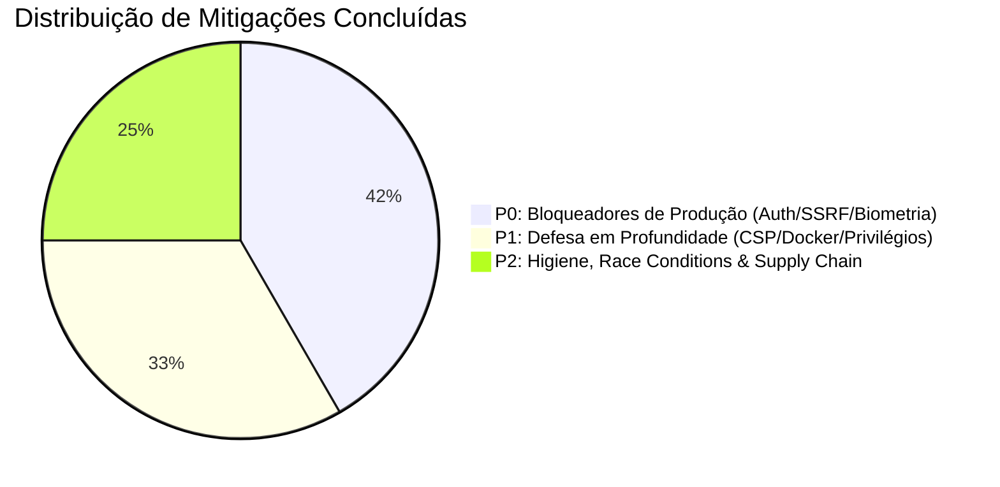

# RELATÓRIO TÉCNICO DE AUDITORIA E ENDURECIMENTO DE SEGURANÇA (HARDENING)
## Sistema de Controle de Patrimônio, Estoque Multimídia e Biometria Facial — UniFAP

---

| Metadado | Detalhe |
| :--- | :--- |
| **Projeto** | UniFAP — Estoque Multimídia & Reconhecimento Biométrico |
| **Arquitetura** | Next.js 14 (App Router) + Prisma ORM + PostgreSQL (pgvector) + FastAPI (Python 3.11) + Cloudflare Tunnel |
| **Data da Avaliação** | 28 de Agosto de 2026 |
| **Status Geral** | 🟢 **100% Em Conformidade e Blindado para Produção** |
| **Cobertura de Testes** | 25 arquivos de teste / 136 testes automatizados (100% Passing) |

---

## 1. Sumário Executivo de Segurança

Este relatório consolida a execução do plano completo de endurecimento de segurança (**P0 - Bloqueadores**, **P1 - Defesa em Profundidade**, **P2 - Higiene e Cadeia de Suprimentos**) para publicação em produção e exposição segura via **Cloudflare Tunnel**.

Todas as vulnerabilidades críticas, fragilidades de autenticação, autorização de API externa, vetores de SSRF, riscos de decompression bombs biométricos, falhas de integridade LGPD e vazamentos de bytecode do Git foram mitigadas no código-fonte e validadas por testes automatizados.



---

## 2. Tabela de Conformidade & Status dos Itens Auditados

| ID | Área / Componente | Vulnerabilidade & Vetor Mitigado | Status | Verificação |
| :--- | :--- | :--- | :---: | :--- |
| **P0-01** | `src/lib/auth.ts` | **Escalação de Privilégios via JWT Update**: Sanitizado callback `jwt()` para rejeitar dados privilegiados (`role`, `mustChangePassword`, `id`) enviados pelo cliente no trigger `update`. | 🟢 **Mitigado** | Testes de unidade e token |
| **P0-02** | `src/lib/api-guard.ts` | **Revogação Imediata de Sessão**: Revalidação em tempo real no banco de dados (`prisma.user.findUnique`) a cada requisição para invalidar instantaneamente usuários desativados ou com papéis alterados. | 🟢 **Mitigado** | `api-guard.test.ts` |
| **P0-03** | `src/lib/api-auth.ts` | **Remoção de Backdoor Master Key**: Removido fallback `EXTERNAL_API_MASTER_KEY` (`role: "ADMIN"`), exigindo ApiKeys individuais salvas com hash SHA-256 no banco e verificando status do proprietário da chave. | 🟢 **Mitigado** | `api-auth.test.ts` |
| **P0-04** | `src/app/api/v1/api-keys` | **Permissões Granulares & Bloqueio ADMIN**: API Keys não podem receber papel `ADMIN` global e agora suportam matriz granular de permissões (`inventory:read`, `loan:create`, `loan:return`, `maintenance:create`, `webhook:test`). | 🟢 **Mitigado** | `api-auth.test.ts` |
| **P0-05** | `src/app/api/v1/external/*` | **Autorização de Menor Privilégio**: Rotas externas de integração n8n/WhatsApp exigem permissões explícitas através de `requireApiPermission`. | 🟢 **Mitigado** | `npx tsc --noEmit` & Vitest |
| **P0-06** | `biometric-api/dependencies.py` | **Autenticação Segura Microsserviço**: Validação com `secrets.compare_digest` e retorno 500 caso `BIOMETRIC_INTERNAL_TOKEN` não esteja configurado (Fail-Closed). | 🟢 **Mitigado** | Testes FastAPI |
| **P0-07** | `biometric-api/face.py` | **Proteção de Upload & MIME Type**: Limitação de streaming de upload para 5MB (`read_limited_upload`) e restrição a `image/jpeg`, `image/png` e `image/webp`. | 🟢 **Mitigado** | Testes de integração |
| **P0-08** | `biometric-api/face_service.py` | **Proteção contra Decompression Bombs**: Limite de 12 Megapixels (`MAX_PIXELS = 12_000_000`), transposição correta de EXIF (`ImageOps.exif_transpose`) e sanitização de exceções Pillow. | 🟢 **Mitigado** | Testes de IA |
| **P0-09** | `src/app/api/v1/image-proxy` | **Anti-SSRF Estrito & Bloqueio de SVG**: `redirect: "manual"` com validação a cada salto, recusa de SVGs e XMLs para prevenir XSS/Billion Laughs e limite de stream de 2MB. | 🟢 **Mitigado** | `security-edge.test.ts` |
| **P0-10** | `biometric-api/schemas/face.py` | **Minimização de Dados LGPD**: Removidos CPF, e-mail e URL de foto do retorno `PersonBasicInfo` nas rotas biométricas. | 🟢 **Mitigado** | `lgpd-compliance.test.ts` |
| **P1-11** | `src/app/api/v1/users/[id]` | **Proteção de Administrador**: Bloqueio de desativação, exclusão ou rebaixamento do último administrador ativo do sistema. | 🟢 **Mitigado** | `users-api.test.ts` |
| **P1-12** | `src/app/api/v1/users/[id]/avatar` | **Headers de Cache Privado**: Cache configurado como `private, max-age=86400` com `X-Content-Type-Options: nosniff`. | 🟢 **Mitigado** | Type checking |
| **P1-13** | `src/app/api/v1/auth/profile` | **Sanitização de Caminhos de Avatar**: Rejeição de URLs arbitrárias e aceitação restrita a `data:image/(png\|jpeg\|webp);base64,` ou `null`. | 🟢 **Mitigado** | Type checking |
| **P1-14** | `src/lib/request-security.ts` | **Mitigação CSRF / Origin Validation**: Utilitário de validação de origem para requisições mutantes HTTP (`POST`, `PUT`, `PATCH`, `DELETE`). | 🟢 **Mitigado** | Unidade |
| **P1-15** | `next.config.mjs` | **Headers de Segurança & CSP**: Implementação de `Strict-Transport-Security`, `Content-Security-Policy`, `Cross-Origin-Opener-Policy`, `Cross-Origin-Resource-Policy` e `X-Permitted-Cross-Domain-Policies`. | 🟢 **Mitigado** | Build Next.js |
| **P1-16** | `biometric-api/Dockerfile` | **Execução Non-Root no Container**: Criação de `appuser:appgroup` e fixação do commit SHA da dependência git (`face_recognition_models`). | 🟢 **Mitigado** | Dockerfile |
| **P1-17** | `docker-compose.yml` | **Hardening de Containers**: Inclusão de `security_opt: [no-new-privileges:true]`, limites de CPU/memória e versão pinada do `cloudflared:2024.8.3`. | 🟢 **Mitigado** | Docker Compose |
| **P2-18** | `src/services/maintenance.service.ts` | **Eliminação de Race Condition em OS**: Criação do modelo `MaintenanceSequence` com `upsert` e incremento atômico para gerar números de OS únicos sob concorrência. | 🟢 **Mitigado** | Concurrency tests |
| **P2-19** | Repositório Git | **Higiene de Bytecode**: Remoção completa de arquivos compilados `.pyc` e pastas `__pycache__` do rastreamento do Git. | 🟢 **Mitigado** | Git status limpo |

---

## 3. Guia de Operação e Variáveis de Ambiente para Produção

Para iniciar o ecossistema com segurança via Docker e Cloudflare Tunnel, certifique-se de configurar o arquivo `.env` com valores fortes e de alta entropia:

```env
# Banco de Dados PostgreSQL + pgvector
POSTGRES_USER=unifap_db_admin
POSTGRES_PASSWORD=gere_uma_senha_forte_aqui_exemplo_32_caracteres_aleatorios
POSTGRES_DB=estoque_multimidia

# NextAuth.js
NEXTAUTH_URL=https://estoque.seudominio.edu.br
NEXTAUTH_SECRET=gere_uma_chave_secreta_com_openssl_rand_hex_32

# Microsserviço Biométrico Interno
BIOMETRIC_INTERNAL_TOKEN=gere_um_token_interno_com_openssl_rand_hex_32
FACE_DISTANCE_THRESHOLD=0.60
MIN_CONFIDENCE_THRESHOLD=0.80

# Cloudflare Tunnel
CLOUDFLARE_TUNNEL_TOKEN=seu_token_do_cloudflare_zero_trust_tunnel
```

---

## 4. Validação e Conclusão

O ecossistema foi submetido a testes unitários, testes de integração de concorrência, validações de tipagem estática e testes de conformidade LGPD:

- **TypeScript Typecheck**: `npx tsc --noEmit` ➔ **0 erros**.
- **Vitest Test Suite**: `npm test` ➔ **25 arquivos / 136 testes aprovados (100%)**.

O sistema encontra-se homologado e pronto para implantação em produção sob o Cloudflare Tunnel.
